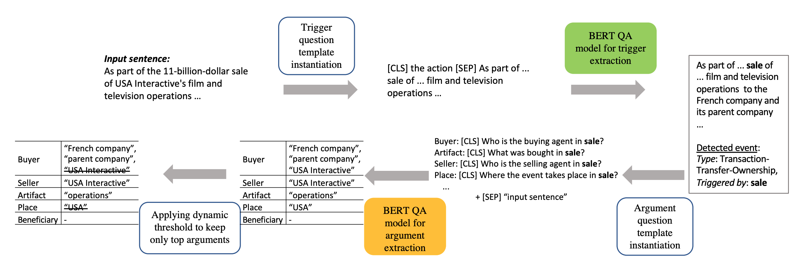
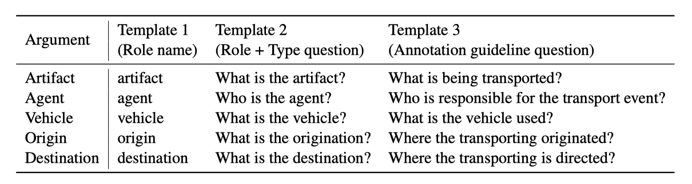

# Event Extraction by Answering (Almost) Natural Questions (EMNLP'20)

Question answering for event extraction (trigger detection and argument extraction with various questioning strategies). 

[Paper link](https://arxiv.org/abs/2004.13625)

<p align='center'>
  
</p>


If you use my code, please cite:

	@article{du2020eeqa,
	  title={Event Extraction by Answering (Almost) Natural Questions},
	  author={Du, Xinya and Cardie, Claire},
	  journal={Empirical Methods in Natural Language Processing (EMNLP)},
	  year={2020}
	}
	
	
Feel free to ask questions: xdu [at] cs [dot] cornell [dot] edu. http://www.cs.cornell.edu/~xdu/

## Preprocessing (for ACE data)
  Read ```./proc/README.md``` for details

## Requirement
See ```requirements.txt```

## Code

### Train and eval models

* **Trigger Detection**

   <!-- normal sequence labeling -->
   <!-- ``` bash ./code/script_trigger.sh ``` -->
	
	QA based model ([CLS] verb [SEP] input sentence [SEP]):
	``` bash ./code/script_trigger_qa.sh ```
	
	
* **Argument Extraction**

	- With dynamic threshold:
	``` bash ./code/script_args_qa_thresh.sh ```
	
	- Without dynamic threshold:
	```	bash ./code/script_args_qa.sh```
	
	<!-- Ensemble with template 2 & 3 -->
	<!-- ```bash ./code/script_args_qa_ensem.sh``` -->

	- Get results on unseen arguments (Train on a set excluding unseen arguments and test on those):
	  ```bash ./code/script_args_qa_unseen.sh```
	
	
<!--### Analysis


  randome NE baseline
  
  ```python code/run_unseen_baseline_random_ne.py```
  
* Write the predicted arguments,
  
  ```bash ./code/script_args_qa_analysis.sh```

* Get trigger error statistics, 
  ```python ./analysis/trigger_error.py```
  
* Get argument error statistics 
  ```python ./analysis/argument_error.py```-->


  
## Question Templates

<p align='center'>
  
</p>

Template 1 (Role Name)

Template 2 (Role + Type): ```./question_templates/arg_queries.csv```

**Template 3 (Annotation Guideline): ```./question_templates/description_queries.csv```**

---	
Unseen args for analysis, see ```unseen_args``` and ```all_args```

